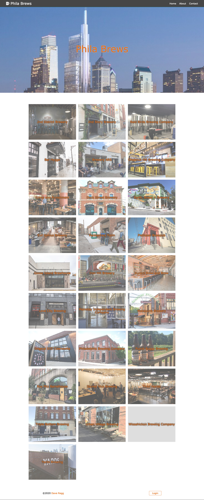

# Phila Brews App
> An app that allows users to browse a database which consists of Philadelphia Breweries. The database has been built and is maintained by me, Dave Regg. Users may click on each brewery to see more information about the brewery - the hours, location, and available beers on tap.

## Table of contents
* [General info](#general-info)
* [Screenshots](#screenshots)
* [Technologies](#technologies)
* [Setup](#setup)
* [Features](#features)
* [Status](#status)
* [Inspiration](#inspiration)
* [License](#license)
* [Contact](#contact)

## General info
This application is fullstack MERN app. The backend is built on an Express server and uses mongoose to contact MongoDB. The Client side is built with React using Redux to maintain the state. The Admin has access to forms which can Create and Update information on the page. The Admin is also able to delete information, all with a little button. Users can get information on breweries and beers. All relevant information was researched, added, and maintained by the Admin, Dave Regg. Leaflet.js is used to render a map with a pin that shows the location of the brewery. Users may contact the Admin with a Contact form.

## Screenshots


## Technologies
* Node - version 12.3.1
* Bcrypt - version 2.4.3
* Express - version 4.17.1
* Jsonwebtoken - version 8.5.1
* Mongoose - version 5.9.15
* Nodemailer - version 6.4.6
* Moment - version 2.26.0
* React-Moment - version 0.9.7
* Axios - version 0.19.0
* React - version 16.13.2
* React-redux - version 7.1.1
* Redux - version 4.0.4
* Leaflet - 1.6.0

## Setup
1. Clone the repo
```sh
git clone https://github.com/drregg6/phila-brews.git
```
2. Install NPM packages
```sh
npm install
```
3. You will need to apply for an API Key from [Leaflet.js](https://leafletjs.com/)

## Features
List of features ready and TODOs for future development
* CSS Grid displays Brewery images with an overlay of the name
* With the help of Leaflet.js, map renders and drops a pin at the brewery's location
* Information in the brewery's banner updates whether they are OPEN or CLOSED based on the time the user renders the page
* Fully built backend with User information, Brewery information, and Beer information
* Desktop to Mobile design
* User can contact Admin with a Contact form
* Admin can delete, update, and create breweries and beers

To-do list:
* Update database

## Status
_Complete_ and _Launched_ although the project could definitely use some updating. You can view the project [here](https://warm-tor-18431.herokuapp.com/)

## Inspiration
I had no idea what time breweries were open and closed, and what time each brewery had happy hour. This was my solution!

## License
Distributed under the MIT License. See `LICENSE` for more information.

## Contact
Dave Regg - [@daveregg](https://www.twitter.com/daveregg) - dave.r.regg@gmail.com

Project Link: [https://github.com/drregg6/phila-brews](https://github.com/drregg6/phila-brews)

## Acknowledgments
* Cold beers
* Warm coffee
* Fun